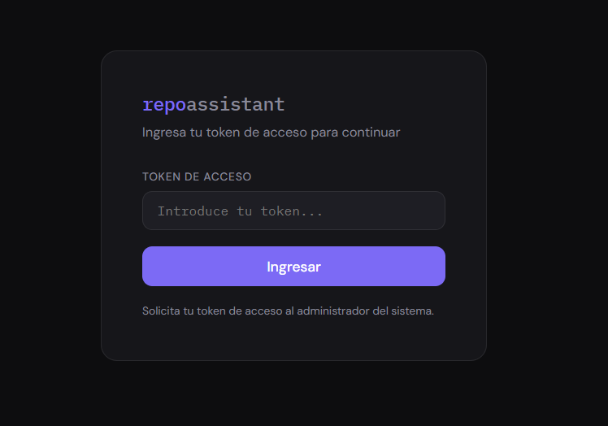
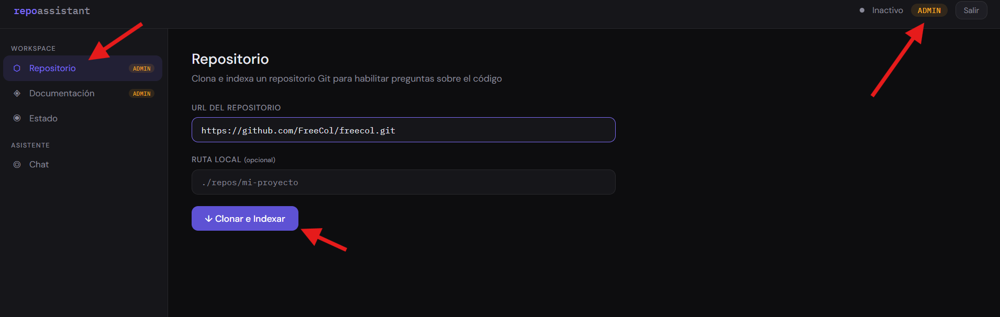
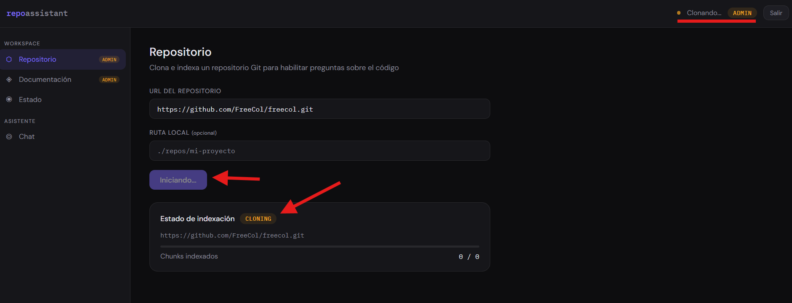
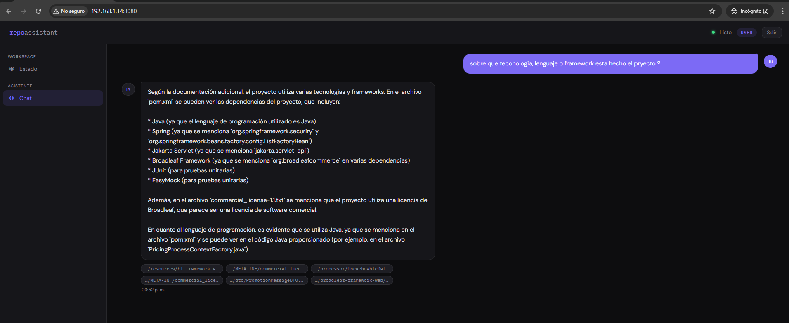

# Repo Assistant

## Descripción

Repo Assistant es una aplicación basada en **Spring Boot** que permite analizar y contextualizar repositorios de código mediante un agente conversacional apoyado en modelos locales (Ollama) y una base de datos vectorial (Qdrant).

El sistema permite:

- Cargar y contextualizar repositorios de código
- Realizar consultas inteligentes sobre el contenido
- Gestionar accesos mediante roles (`user` y `admin`)

## Arquitectura

La solución está compuesta por los siguientes componentes:

- **Backend**: Spring Boot
- **Modelo LLM local**: Ollama
- **Base de datos vectorial**: Qdrant (dockerizada)
- **Frontend**: (si aplica, puedes completar aquí)

## Requisitos

Antes de ejecutar el proyecto, asegúrate de tener instalado:

- Java 17+
- Docker y Docker Compose
- Ollama instalado y funcionando

## Configuración de Qdrant (Docker)

La base de datos vectorial se encuentra dockerizada para facilitar su despliegue.

### Ejecutar Qdrant:

```bash
docker run -p 6333:6333 qdrant/qdrant
```

O si usas docker-compose:

```bash
docker-compose up -d
```

## Configuración de Ollama

Asegúrate de tener Ollama instalado y ejecutándose.

### Verificar instalación:

```bash
ollama list
```

### Descargar modelo (ejemplo):

```bash
ollama pull mistral
```

## Ejecución del Proyecto

1. Ejecutar la aplicación:

```bash
./mvnw spring-boot:run
```

O con Maven instalado:

```bash
mvn spring-boot:run
```

## Acceso a la Aplicación

El sistema cuenta con dos roles:

| Rol   | Descripción                            |
| ----- | -------------------------------------- |
| user  | Acceso básico al agente conversacional |
| admin | Acceso completo, incluyendo gestión    |

### Passkeys

Cada rol requiere un passkey específico ubicados en el archivo de configuracion del proyecto

## Flujo de Uso

### 1. Ingreso a la Aplicación

aca se debe de ingresar el token especifico de acuerdo al rol que se desee ingresar



### 2. Contextualización del Repositorio

Antes de usar el agente, es necesario cargar un repositorio para que la herramienta lo procese.

#### Pasos:

- Subir o vincular el repositorio
  Para poder subir el repositorio se debe contar con el rol de `ADMIN` unicmanete



- Esperar el procesamiento e indexación en Qdrant



### 3. Uso del Agente Conversacional

Una vez cargado el repositorio, puedes interactuar con el agente.

Ejemplos de preguntas:

- ¿Cuál es la arquitectura del proyecto?
- ¿Qué hace esta clase?
- ¿Dónde se maneja la autenticación?

El agente conversacional esta habilitado para el rol de `ADMIN` o `USER`


## Funcionamiento Interno

1. El repositorio se procesa y divide en fragmentos
2. Se generan embeddings usando el modelo de Ollama
3. Se almacenan en Qdrant
4. El agente consulta los embeddings para responder preguntas

## Estructura del Proyecto

repo-assistant/
│── src/
│ ├── main/
│ │ ├── java/
│ │ ├── resources/
│── docker/
│── README.md
│── pom.xml

```


## Configuración

Archivo de configuración principal:

```

src/main/resources/application.yml

````

Variables importantes:

```yaml
qdrant:
  host: localhost
  port: 6333

ollama:
  url: http://localhost:11434
````
